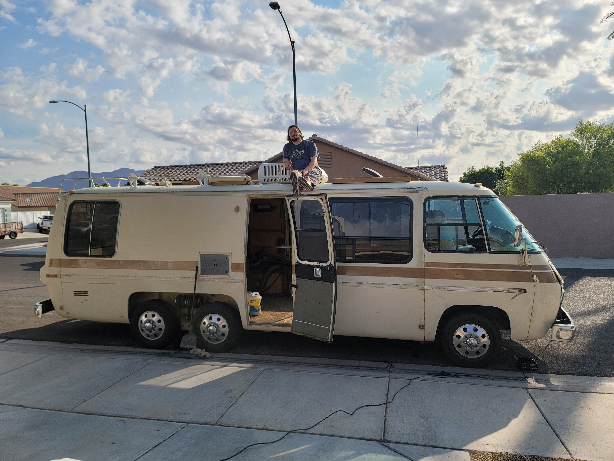

# BunkBedCar

Welcome to our future web site featuring our BunkBedCar (coined by our
daughter Penelope, age 6). She is a 1977 GMC Eleganza II based here in Las
Vegas, NV.



## Developing

Once you've setup the project and installed dependencies with `npm install` start the development server:

```bash
npm run dev

# or start the server and open the app in a new browser tab
npm run dev -- --open
```

## Building

Before creating a production version of your app, install an [adapter](https://kit.svelte.dev/docs#adapters) for your target environment. Then:

```bash
npm run build
```

> You can preview the built app with `npm run preview`, regardless of whether you installed an adapter. This should _not_ be used to serve your app in production.
